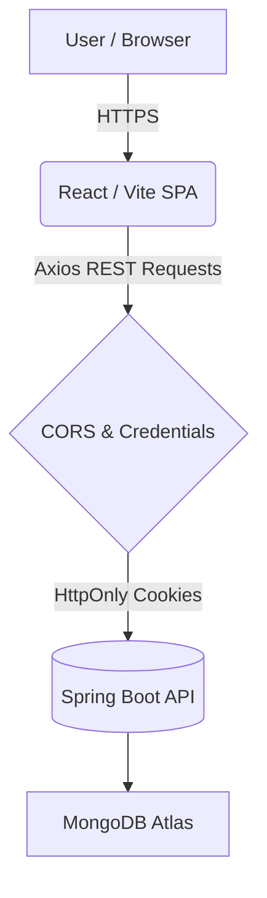

<div align="center">
  
# 📝 JotSpace

**A Secure, Full-Stack Personal Notes Workspace Built for Productivity**

[](https://jotspace-frontend.vercel.app/)
[](https://jotspace-backend.onrender.com/)
[](#)
[](#)
[](#)

</div>

---

## 📖 Overview

JotSpace is a modern, responsive, and highly secure unified workplace for organizing thoughts, capturing ideas, and managing daily tasks. This repository hosts the **Frontend Web Application** built with React, Vite, and TypeScript. It is designed with a premium, sleek aesthetic, incorporating rich text editing, intelligent filtering, and seamless user experiences.

The frontend natively interacts with our custom **Spring Boot & MongoDB Backend**, utilizing secure HTTP-only cross-origin JWTs for session management.

---

## ✨ Key Features

- **🛡️ Enterprise-Grade Authentication:** Seamless login/registration flows leveraging secure, `SameSite=None` HttpOnly JWT cookies across domains.
- **🎨 Modern Aesthetic & UX:** A stunning, fully responsive UI built with custom CSS tokens, smooth routing via React Router DOM, and intuitive toast notifications.
- **✍️ Rich Text Editing:** Seamless markdown and block styling support integrated via React Quill.
- **🏷️ Smart Organization:** Custom tag management and dynamic, real-time filtering to instantly find any note.
- **🗑️ Soft Deletion & Trash Management:** Safely move notes to a trash bin, ensuring accidental deletions can be restored.
- **🌗 Theming Context:** In-built light/dark mode integrations prioritizing accessibility and reading comfort.

---

## 🛠️ Technology Stack (Frontend)

| Category | Technology | Description |
| :--- | :--- | :--- |
| **Framework** | **React 19** | Latest concurrent React rendering. |
| **Bundler** | **Vite** | Blazing fast HMR and optimized production builds. |
| **Language** | **TypeScript** | Strict end-to-end type safety. |
| **Routing** | **React Router DOM 7** | Client-side SPA routing. |
| **HTTP Client** | **Axios** | Interceptor-configured REST API calls with implicit credentials. |
| **Rich Text** | **React Quill** | Robust block-level text editor. |
| **Icons** | **Lucide React** | Beautiful, lightweight SVG injection. |

---

## 🏗️ Architecture & Flow

JotSpace utilizes a strict Context-based architecture to isolate authentication states from DOM logic:
1. **AuthProvider:** Validates HttpOnly session cookies implicitly on mount.
2. **Axios Interceptor:** Catches global `401 Unauthorized` API errors and triggers safe redirects to the `/login` boundary.
3. **Private Routes:** Wrapping the Dashboard via `<PrivateRoute>` context constraints.



---

## 💻 Local Setup & Installation

Follow these steps to run the frontend application locally:

### 1. Pre-requisites
- **Node.js** (v18.0.0 or higher)
- **NPM** or **Yarn**

### 2. Clone the Repository
```bash
git clone https://github.com/amarchavan-1/jotspace-frontend.git
cd jotspace-frontend
```

### 3. Install Dependencies
```bash
npm install
```

### 4. Configure Environment Variables
By default, the application connects to the live production server. To run against a local backend, create a `.env` file in the root directory:
```env
VITE_API_BASE_URL=http://localhost:8080
```
*(Make sure to update `src/api/client.ts` to utilize `import.meta.env.VITE_API_BASE_URL` if testing locally).*

### 5. Start Development Server
```bash
npm run dev
```
The application will launch locally at `http://localhost:5173`.

---

## 🚀 Deployment (Vercel)

This application is optimized for Vercel. 
- SPA Routing is handled properly via `vercel.json` rewrites logic to prevent 404s on refresh.
- Production builds are dynamically typed checked via `tsc -b && vite build`.
